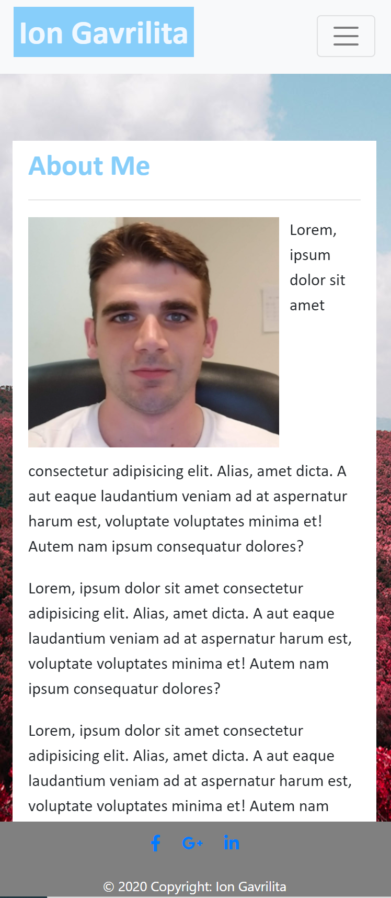

# Responsive Portfolio

## Description of project
Portfolio Site was developed for devices with variety window screen size, using Bootstrap elements to minimize the use of media queries.

## Changelog index.html
* Navbar was attached from getbootstrap.com, added functional link.
* Background image was attached from mdbootstrap.com
* Main element  was built with 2 container:
   1) Main element container was given 8 colomns for a medium device responsive.
   2) Sub Main element container was devided in 2 rows:
      a) Header. 
      b) Image and personal bio info.
* Footer was imported from mdbootstrap.com including active link to social media.

## Changelog contact.html
* Navbar was attached from getbootstrap.com, added functional link.
* Background image was attached from mdbootstrap.com
* Main element  was built with 2 container:
   1) Main element container was given 8 colomns for a medium device responsive.
   2) Sub Main element container was devided in 5 rows:
      a) Header. 
      b) Imported bootstrap element contact name.
      c) Imported bootstrap element contact email.
      d) Imported bootstrap text message validation.
      e) Imported submit button validation.
* Footer was imported from mdbootstrap.com including active link to social media.

## Changelog portfolio.html
* Navbar was attached from getbootstrap.com, added functional link.
* Background image was attached from mdbootstrap.com
* Main element  was built with 2 container:
   1) Main element container was given 8 colomns for a medium device responsive.
   2) Sub Main element container was devided in 4 rows:
      a) Header. 
      b) 3 Rows is split in 2 equal colomns which is holdin a placeholder image 350x350, the placeholder hold the same position on md device screen with resolution 768>up, below is going in 1 colomn.
* Footer was imported from mdbootstrap.com including active link to social media.

## Changelog style.css
The file contain style attribute, background image attribute, footer styling and container style.

## Credits:
* https://getbootstrap.com/ - element source
* https://mdbootstrap.com/ - element source
* https://www.w3schools.com/bootstrap/bootstrap_get_started.asp - information source

## Images with responsive site:
* Home/ Main Page

* Portfolio

* Contact

## Contributing:
* Name: Ion Gavrilita
* Email: gavrilita.ion.93@gmail.com
* Github profile: https://github.com/IonGavrilita

## Directory:
* Website: https://iongavrilita.github.io/h2_bootstrap_portfolio/
* Source: https://github.com/IonGavrilita/h2_bootstrap_portfolio
